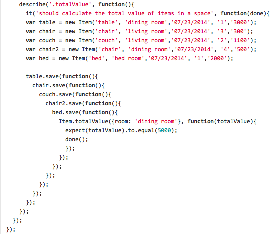

# 为什么学习 Kotlin 协程？

为什么要学习 Kotlin 协程呢？我们已经有很完善的同类型 JVM 库，例如 RxJava 和 Reactor。此外，Java 本身就支持多线程，大多数人也都选择使用那些普通的、旧的回调函数来开发。显然，我们已经有许多执行异步操作的选择。

Kotlin 协程提供的能力远远不止这些。协程是一个早在1963年就被提出的概念，但经过了数十载才在适合的行业上被实现了出来。Kotlin 协程将半个世纪前的提出的强大概念实现到了一个库中，该库旨在完美地帮助程序员完成日常的开发工作。更重要的是，Kotlin 是多平台的，这意味着它们可以跨所有 Kotlin 平台（如 JVM、 JS、iOS、以及在公共模块中）使用。最后，它们不会彻底改变代码结构，所以我们可以几乎毫无成本的使用大多数 Kotlin 协程的功能（点名批评 RxJava 和回调函数）。这使它们对初学者来说非常友好。

来看看一些实际情况，我们将在一些常见用例中，比较协程和其它一些常见方案的解决途径。 下面将展示两个典型的案例： Android 和后端业务逻辑实现。先让我们从第一个开始。

### Android （以及其他前端平台）上的协程

当你在前端实现应用逻辑时，你可能最常的三件事情是：

1. 从一个或多个来源（API、视图元素、数据库、Perference、另一个应用程序）获取一些数据
2. 处理这些数据
3. 对这些数据做些什么（将这些视图显示出来、存储在数据库中、发送给 API）

为了使讨论更加贴地，让我们首先假设正在开发一个 Android 应用程序，然后有这么一种情况：我们需要从一个 API 中获取新闻信息，然后对其进行排序，并将其显示在屏幕上，下面就是描述这段行为的函数：

```kotlin
fun onCreate() {
    val news = getNewsFromApi()
    val sortedNews = news
        .sortedByDescending { it.publishedAt }
    view.showNews(sortedNews)
}
```

遗憾的是，上面的代码想要实现我们的预期行为，几乎是不可能的。因为在 Android 中，每个应用程序只有一个线程可以修改视图。这个线程是非常重要的，不该被阻塞。而如果这段函数在主线程上启动，`getNewsFromApi` 就会阻塞线程，这样我们的应用程序会崩溃。而如果它在另一个线程上启动，当我们调用 `showNews` 时，同样也会崩溃，因为这行代码必须在主线程上运行。这就是上面代码不能实现我们预期行为的原因。

### 线程切换

我们可以通过切换线程来解决这些问题。首先我们先切换到可被阻塞的线程，接着再切回主线程。

```kotlin
fun onCreate() {
    thread {
        val news = getNewsFromApi()
        val sortedNews = news
            .sortedByDescending { it.publishedAt }
        runOnUiThread {
            view.showNews(sortedNews)
        }
    }
}
```

这样的线程切换我们仍然可以在一些应用程序的源码中找到，但是这样的代码被认为是有问题的，有下面几个原因:

* **这里没有取消线程的机制**，所以这段代码将面临内存泄漏的问题
* **创建这么多线程，成本很高**
* **频繁切换线程，会造成代码逻辑混乱，难以管理**
* **代码将不必要的变大、变复杂**

为了解释这些问题不是空穴来风，请你想象一个场景：你打开并迅速关闭一个视图。在打开时，你可能会启动多个获取和处理数据的线程。在不取消它们的情况下，仍然会在后台做它们的工作，最后试图去修改一个不存在的视图。这意味着设备需要做不必要的事情，后台可能会出现异常，天知道会导致什么意外的结果。

考虑到所有这些问题，让我们来寻求一个更好的方案吧。

### 回调

回调是另一种可以用来解决问题的方式。其思想是将我们的代码写成非阻塞式的，但我启们需要在启动任务时传递给它们一个函数，一旦任务完成，这个函数就会被执行（这就是回调函数），如果我们使用这种方式，代码将会是这样的：

```kotlin
fun onCreate() {
    getNewsFromApi { news ->
        // 这里在 getNewsFromApi 中切回主线程中运行
        val sortedNews = news
            .sortedByDescending { it.publishedAt }
            view.showNews(sortedNews)
    }
}
```

请注意，这个实现不支持取消。我们可以创建支持取消的回调函数，但这并不简单。不仅每个回调函数都需要为支持取消而专门实现，而且为了取消它们，我们还要分别去存储这些对象（句柄）：

```kotlin
fun onCreate() {
    startedCallbacks += getNewsFromApi { news ->
        val sortedNews = news
            .sortedByDescending { it.publishedAt }
        view.showNews(sortedNews)
    }
}
```

回调架构解决了这个简单的问题，但是它仍然有很多缺点。为了探究这些问题，让我们讨论一个更复杂的情况：假设我们需要从三个地方获取数据：

```kotlin
fun showNews() {
    getConfigFromApi { config ->
        getNewsFromApi(config) { news ->
            getUserFromApi { user ->
                view.showNews(user, news)
            }
        }
    }
}
```

这段代码远远称不上好，原因如下：

* 获取新闻（`getNewsFromApi`）和用户数据（`getUserFromApi`）可能是并行的，但是我们的回调框架不支持这点，或者很难通过回调来实现
* 如上所述，如果要支持取消，我们必须要做大量的、额外的努力才行
* 不断增加的代码缩进使得可读性大大降低（带有多个回调的代码通常被认为是高度不可读的）。这种情况被称为“回调地狱”，在一些旧的 Node.JS 项目中尤其常见：



* 当我们使用回调函数时，很难控制后面将会发生什么。以下显示进度指示器的方式是行不通的：

```kotlin
fun onCreate() {
    showProgressBar()
    showNews()
    hideProgressBar() // Wrong
}
```

在开启展示新闻的任务（`showNews`）后，进度条将会立马隐藏。为了解决这个问题，我们需要给 `showNews` 设置回调函数：

```kotlin
fun onCreate() {
    showProgressBar()
    showNews {
        hideProgressBar()
    }
}
```

这就是回调架构对于这种重要的场景所提供的解决方案比较逊的原因。让我们看看另一种方案： RxJava 或其它响应式流。

### RxJava 或其它响应式流

一种在 Java（包括 Android 和后端）中主流的替代方案是使用响应式流（或响应式扩展）：RxJava 或者它的接班人 Reactor。使用这种方法，启动、处理、观察等所有操作都发生在数据流中，这些流支持切换线程和并发处理，因此它们经常用于应用程序中的并发处理。

下面是我们使用 RxJava 解决问题的方法：

```kotlin
fun onCreate() {
    disposables += getNewsFromApi()
        .subscribeOn(Schedulers.io())
        .observeOn(AndroidSchedulers.mainThread())
        .map { news ->
            news.sortedByDescending { it.publishedAt }
        }
        .subscribe { sortedNews ->
            view.showNews(sortedNews)
        }
}
// 这里的 disposables 指的是那些当用户离开当前页面时，需要取消的数据流
```

这绝对是一个比回调更好的解决方案，它：没有内存泄漏、支持取消、正确的使用线程。唯一的缺点可能就是它比较复杂，如果你将它与最开始的“理想中的代码”（如下所示）进行比较，你就会发现它们几乎没有共同之处。

```kotlin
fun onCreate() {
    val news = getNewsFromApi()
    val sortedNews = news
        .sortedByDescending { it.publishedAt }
    view.showNews(sortedNews)
}
```

所有这些函数，如 `subscribeOn`、`observeOn`、`map` 或者 `subscribe`，都需要学习。取消句柄需要声明；函数需要封装在 `Observable` 或者 `Single` 类中的对象。在实战中，当我们引入 RxJava 时，就需要重新组织我们的代码。

```kotlin
fun getNewsFromApi(): Single<List<News>>
```

考虑第二个问题，对于这个问题，我们需要在显示数据之前从三个地方获取数据源。这可以用 RxJava 来解决，但会相对更加复杂一点：

```kotlin
fun showNews() {
    disposables += Observable.zip(
        getConfigFromApi().flatMap { getNewsFromApi(it) },
        getUserFromApi(),
        Function2 { news: List<News>, config: Config ->
            Pair(news, config)
        })
        .subscribeOn(Schedulers.io())
        .observeOn(AndroidSchedulers.mainThread())
        .subscribe { (news, config) ->
        view.showNews(news, config)
    }
}
```

这段代码是真正并发的，也没有内存泄漏，但是我们需要引入RxJava 的操作符，例如 `zip` 或者 `flatmap`，将值打包到 `Pair` 中，对其进行分解。这是一个正确的实现，但它相当复杂。最后，让我们看看协程能给我们带来什么。

### 使用 Kotlin 协程

Kotlin 协程引入的核心功能是：**在某一时刻暂停协程后，有能力在未来恢复它**。因此，我们可以在主线程上运行代码，并在请求 API 数据时挂起主线程。 当一个协程挂起时，主线程就不会被阻塞而可以自由运行，因此它可以用来改变视图或处理其它协程。一旦数据准备好了，协程就会等待主线程（这是很少见的情况，但是真可能会有一个协程队列在等待它），一旦该协程等待获得线程，它就可以从停止的地方继续。

.png>)

上面这张图片中： `updateNews` 和 `updateProfile` 两个函数被运行在主线程上的两个独立协程中。它们可以交替执行，因为它们挂起了它们的协程，而非阻塞线程。当 `updateNews` 函数等待网络响应时，主线程将会被 `updateProfile` 使用，这里假设 `getUserData` 因为没有任何缓存数据，而没有被挂起，因此它可以立马运行完成。对于网络响应来说，这段时间还不够用，所以 `updateNews` 还没有使用主线程（主线程这个时候可以被其他函数使用）。一旦数据响应，`updateNews` 函数将获取主线程，并从 `getNewsFromApi` 之后的那行代码开始。

> 根据定义，协程是可以挂起（suspend）和恢复（resume）的组件。像 `async/await` 或 `generators` 这样的概念，可以在 JavaScript、Rust 或 Python 等语言中使用，它们也可以使用协程，但它们的能力非常有限。

所以，我们的第一个问题可以通过使用 Kotlin 协程来解决，方法如下：

```kotlin
fun onCreate() {
    viewModelScope.launch {
        val news = getNewsFromApi()
        val sortedNews = news
            .sortedByDescending { it.publishedAt }
        view.showNews(sortedNews)
    }
}
// 这里，我使用了 viewModelScope，它在 Android 项目中非常常见。
// 我们可以使用自定义作用域，我们稍后再来讨论这些选项。
```

这段代码几乎与我们从一开始就想要的代码完全相同！在这个解决方案中，代码运行在主线程上，但它不会阻塞线程，由于挂起机制，当需要等待数据时，我们会挂起（而非阻塞）线程，当协程被挂起时，主线程可以去做其他事情，比如绘制一个漂亮的进度条动画。一旦数据准备好，我们的协程将获取主线程，并从它之前停止的地方开始。对于另一个“地狱回调”的案例呢？也可以用类似的方法解决：

```kotlin
fun showNews() {
    viewModelScope.launch {
        val config = getConfigFromApi()
        val news = getNewsFromApi(config)
        val user = getUserFromApi()
        view.showNews(user, news)
    }
}
```

这个解决方案看起来不错，但它不是最优的，这些函数将逐个调用，所以如果每个调用花费1s，这个函数将花费3s而不是2s。如果我们并行调用 Api ，就可以实现这一点。这就是 Kotlin 协程库帮助我们使用 `async` 等函数的地方，它可以立即启动带有某些请求的另一个协程，并等待稍后响应的结果（使用 `await` 函数）。

```kotlin
fun showNews() {
    viewModelScope.launch {
        val config = async { getConfigFromApi() }
        val news = async { getNewsFromApi(config.await()) }
        val user = async { getUserFromApi() }
        view.showNews(user.await(), news.await())
}
```

这段代码仍然简单易读。它使用了在其他语言（包括 JavaScript 或 C#）中很流行的 `async/await` 模式。它还非常高效，不会导致内存泄漏。该段代码的实现即简单又优秀。

使用 Kotlin 协程，我们可以轻松实现不同的用例，并同时使用其他的 Kotlin 特性。例如，它不会阻塞我们使用 for 循环或集合处理函数。下面这段代码中，你可以看到如何并行加载或逐页加载：

```kotlin
// 所有页面将同时加载
fun showAllNews() {
    viewModelScope.launch {
        val allNews = (0 until getNumberOfPages())
            .map { page -> async { getNewsFromApi(page) } }
            .map { it.await() }
        view.showAllNews(allNews)
    }
}

// 逐页加载
fun showPagesFromFirst() {
    viewModelScope.launch {
        for (page in 0 until getNumberOfPages()) {
            val news = getNewsFromApi(page)
            view.showNextPage(news)
        }
    }
}
```

### 后端上的协程

在我看来，在后端使用协程的最大优点是它足够简单。与 RxJava 不同，使用协程几乎不会改变代码外观，从线程迁移到协程只需要添加 `suspend` 修饰符。当我们这样做时，可以很容易地引入并发、测试并行行为、取消协程、并使用我们将在本书中探讨的所有其它强大特性。

```kotlin
suspend fun getArticle(
    articleKey: String,
    lang: Language
): ArticleJson? {
    return articleRepository.getArticle(articleKey, lang)
        ?.let { toArticleJson(it) }
}

suspend fun getAllArticles(
    userUuid: String?,
    lang: Language
): List<ArticleJson> = coroutineScope {
    val user = async { userRepo.findUserByUUID(userUuid) }
    val articles = articleRepo.getArticles(lang)
    articles
        .filter { hasAccess(user.await(), it) }
        .map { toArticleJson(it) }
}
```

除了所有这些特性之外，使用协程还有一个更重要的原因：**线程开销很大**。**它们需要被创造、维护，并且还要分配其内存**。如果你的应用程序被数百万个用户使用，并且当你在等待数据库或其他服务的响应时出现阻塞，这将会大大增加内存和处理器的负担（用于创建、维护和同步这些线程）。

这个问题可以通过以下代码来展现，这些代码片段模拟一个有100,000个用户同时请求数据的后端服务。

* 第一个代码段将启动100,000个线程，并使它们休眠一秒（以模拟等待来自数据库或其它服务的响应）。如果你在计算机上运行它，你将看到它需要一段时间来打印所有这些点，或者它将以 OutOfMemoryError 异常中断。这是运行大量线程的成本。
* 第二个代码段使用协程而不是线程，并挂起它们而非休眠。如果你运行它，程序会等待1秒钟，然后打印所有的点，启动所有这些协程的成本非常低，低到几乎可以忽略。

```kotlin
fun main() {
    repeat(100_000) {
        thread {
            Thread.sleep(1000L)
            print(".")
        }
    }
}

fun main() = runBlocking {
    repeat(100_000) {
        launch {
            delay(1000L)
            print(".")
        }
    }
}
```

### 结论

我希望你现在有了了解更多关于 Kotlin 协程知识的信心。它们不仅仅是一个库，它们还使得现代工具进行并发编程更加容易。如果这个问题解决了，我们就开始学习吧。在本章的其余部分，我们将探讨 `suspend` 是如何工作的：首先从实际使用出发，然后再深入到底层。
